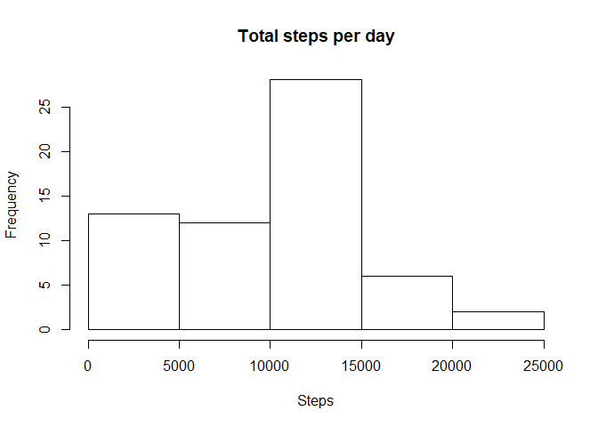
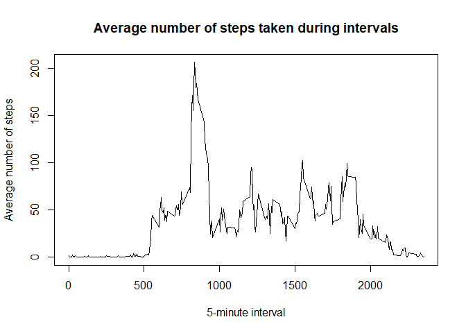
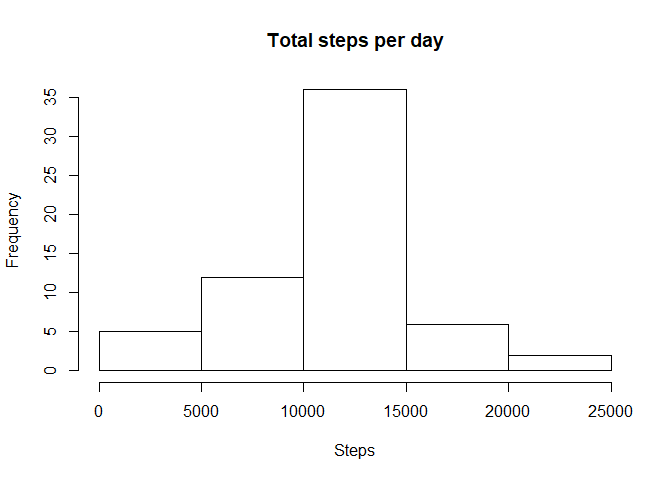
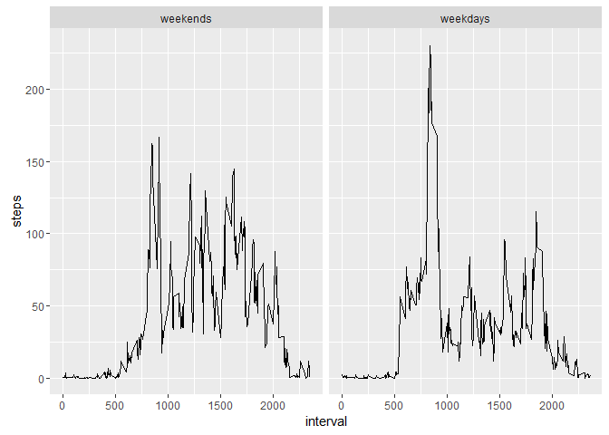

### 1. Code for reading in the dataset and/or processing the data
Load libraries

```r
library(lubridate)
library(dplyr)
library(ggplot2)
```

Load the data 

* ab
* cd 


```r
df <- read.csv("activity.csv", header = TRUE, sep = ",")
```
Format date type   

```r
df$date <- ymd(df$date)
```
&nbsp;

### 2. Histogram of total number of steps taken each day
Total number of steps by date, prepare for plotting

```r
dates <- group_by(df, date)
steps.sum.date <- summarize(dates, steps = sum(steps, na.rm = TRUE))
```
Plot the histogram

```r
hist(steps.sum.date$steps, breaks = 5, main = "Total steps per day", xlab = "Steps")
```

<!-- -->
&nbsp;

### 3. Mean and median number of steps taken each day
Mean of steps taken each day 

```r
mean(steps.sum.date$steps)
```

```
## [1] 9354.23
```
Median of steps taken each day

```r
median(steps.sum.date$steps)
```

```
## [1] 10395
```
&nbsp;

### 4. Time series plot of the average number of steps taken
Average of steps on each interval 

```r
itvs <- group_by(df, interval)
steps.avg.itv <- summarize(itvs, steps= mean(steps, na.rm = TRUE))
```
Illustrate the average of steps on intervals

```r
plot(steps.avg.itv$interval, steps.avg.itv$steps, type="l", 
     main = "Average number of steps taken during intervals", 
     xlab = "5-minute interval", ylab = "Average number of steps")
```

<!-- -->
&nbsp;

### 5. The 5-minute interval that, on average, contains the maximum number of steps

```r
steps.avg.itv[which.max(steps.avg.itv$steps),]
```

```
## # A tibble: 1 × 2
##   interval    steps
##      <int>    <dbl>
## 1      835 206.1698
```
&nbsp;

### 6. Code to describe and show a strategy for imputing missing data
Create a function to get the mean steps of a certain interval

```r
itv.mean <- function(itv){
   steps.avg.itv[steps.avg.itv$interval == itv,"steps"]
}
```
Create a new dataset that is equal to the original dataset but with the missing data filled in.

```r
dff <- df
for (i in 1:nrow(dff)) {
   if (is.na(dff[i,"steps"])) {
      dff[i,"steps"] <- ceiling(itv.mean(dff[i,"interval"]))
   }
}
```
&nbsp;

### 7. Histogram of the total number of steps taken each day after missing values are imputed
Sum of steps by dates on new dataset

```r
dates <- group_by(dff, date)
steps.sum.date <- summarize(dates, steps = sum(steps, na.rm = TRUE))
```

Histogram 

```r
hist(steps.sum.date$steps, breaks = 5, main = "Total steps per day", xlab = "Steps")
```

<!-- -->
&nbsp;

### 8. Panel plot comparing the average number of steps taken per 5-minute interval across weekdays and weekends
Create new variables on weekday and isweekday

```r
dff$weekday <- factor(weekdays(dff$date)) # weekdays
dff <- mutate(dff, isweekend = factor(weekday %in% c("Saturday", "Sunday"), levels = c(TRUE, FALSE), labels = c("weekends","weekdays")))
```

Sum of steps on interval separated by date type

```r
steps.itv.date_type = aggregate(steps ~ interval + isweekend, dff, mean)
```

Draw two graphs separated by date type 

```r
g <- ggplot(steps.itv.date_type, aes(interval, steps))
g +  facet_grid(. ~ isweekend) + geom_line(linetype = "solid")
```

<!-- -->

